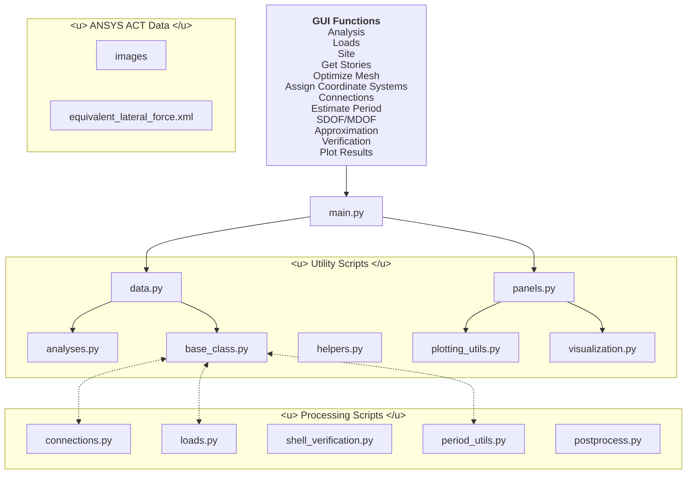

# Extension Overview

This page displays the architecture of the extension and its components. For a detailed overview of the workflow, go to [**Tools/Equivalent Lateral Force**](../tools/equivalent_lateral_force/elf.md).

- [Architecture](#architecture)
- [Requirements (as Tested)](#requirements-as-tested)
- [ANSYS ACT Data](#ansys-act-data)
- [GUI Functions](#gui-functions)
- [Utility Scripts](#utility-scripts)
    - [`data.py`](#datapy)
    - [`panels.py`](#panelspy)
    - [`analyses.py`](#analysesspy)
    - [`base_class.py`](#base_classpy)
    - [`helpers.py`](#helperspy)
    - [`plotting_utils.py`](#plotting_utilspy)
    - [`visualization.py`](#visualizationpy)
- [Processing Scripts](#processing-scripts)
    - [`connections.py`](#connectionsspy)
    - [`loads.py`](#loadspy)
    - [`shell_verification.py`](#shell_verificationpy)
    - [`period_utils.py`](#period_utilspy)
    - [`postprocess.py`](#postprocesspy)

## Architecture

The ANSYS ACT is packaged in the following format:

<u>Note:</u> *most significant function calls and data transfers displayed*

## Requirements *(as Tested)*

- ANSYS Workbench 2026/R1 including:
    - Mechanical
    - Discovery or Spaceclaim *(if modeling directly within Workbench)*
- IronPython 2.7.4 (bundled with ANSYS)

## ANSYS ACT Data

### `equivalent_lateral_force.xml`
Establishes connections between Workbench and the extension and stores GUI elements.

### `images/`
Directory for relevant GUI icons.

## GUI Functions
*For process details, go to page:*

- [Analysis](../tools/equivalent_lateral_force/elf.md)
- [Loads](../tools/loads.md)
- [Site](../tools/equivalent_lateral_force/elf.md)
- [Get Stories](../tools/equivalent_lateral_force/elf.md)
- [Optimize Mesh](../tools/equivalent_lateral_force/elf.md)
- [Assign Coordinate Systems](../tools/equivalent_lateral_force/elf.md)
- [Connections](../tools/connections.md)
- [Estimate Period](../tools/equivalent_lateral_force/elf.md)
- [SDOF/MDOF Approximation](../tools/equivalent_lateral_force/elf.md)
- [Verification](../tools/verification.md)
- [Plot Results](../tools/visualization.md)

## `main.py`
Acts as the compatibilty layer between ACT and function scripts. Uses lazy function calls and injects API into distributed scripts.

## Utility Scripts

### `data.py`
Stores default values for calculations, defined according to SIA 260 ([*Inputs*](../tools/equivalent_lateral_force/inputs.md)). Handles I/O with ANSYS simulation objects and state save files for extension parameters.

### `panels.py`
Defines utilities and function calls for drawing function-specific GUI panels and relevant plots. Calls backend functions within relevant sections.

---

### `analyses.py`
Handles *Mechanical: Analysis* objects, computes SDOF and MDOF approximations.

### `base_class,py`
Data class storing geometric simulation data and geometric pre-processing methods. For detailed overview, see [`SeismicNodes`](../data_classes/dataclass.md).

### `helpers.py`
Stores data and math utilities commonly used in other functions.

### `plotting_utils.py`
Includes plotting scripts for drawing spectra, SDOF/MDOF displacement curves and related utilities.

### `visualization.py`
Plotting scripts for single-surface results. For detailed overview, see [**Visualization**](../tools/visualization.md).

## Processing Scripts

### `connections.py`
Functions for identifying corresponding nodes and generating connections via APDL. For detailed overview, see [**Connections**](../tools/connections.md).

### `loads.py`
Functions for identifying surfaces and applying pre-defined or customized loads in batch. For detailed overview, see [**Loads**](../tools/loads.md).

### `shell_verification.py`
Functions for processing element-level FE results and evaluating material failure. For detailed overview, see [**Verification**](../tools/verification.md).

### `period_utils.py`

### `postprocess.py`

## To be implemented:
- loading based on equivalent lateral forces
- time-history analysis
- response spectrum analysis
    - lumped-mass simplification
    - direct M/K
- static pushover
- performance-based assessment
- code compliance

*Jump to subsection:*
- [Linear Static Analysis]()
- [Linear Dynamic Analysis]()
- [Nonlinear Static Analysis]()
