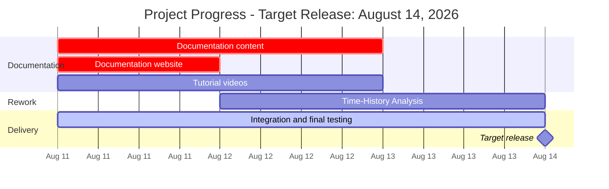

# Project Status

Feature | Support
---     | :-:
Equivalent Lateral Force            | **Yes**
Failure Criteria                    | **Yes**
Modal Response Spectrum             | **Yes**
Linear Time-History Analysis        | **No**
Non-Linear Time-History Analysis    | **No**
CMM-Usermat                         | **No**
URM-Usermat                         | **No**
Pushover                            | **No**
