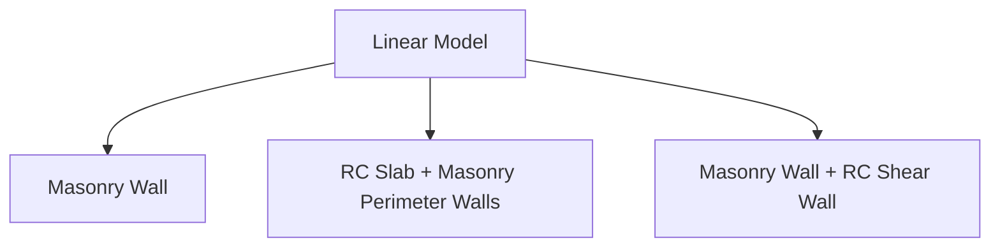

# Ansys Dummy Models Used for Prototyping

## Process

Open the provided project file in *Ansys Workbench* to get started

<u>Step-by-step instructions</u>

1. Define material properties in *Workbench* as specified in [**Material Properties**](#material-properties)
2. Define geometry, as outlined in [**Geometry**](#geometry)
3. Open model in *Mechanical* interface
4. 
Define boundary conditions, loads, assign materials, generate mesh

## Material Properties
- `Structural Steel`: kept as-is
- `C30/37 Concrete`: defined as follows:

    | Property      | Value     | Unit      | Notes
    |---            |---        |---        |---|
    |Density        | 2500      | $kg/m^3$  |-
    |$E$            |33         |$GPa$
    |$\nu$          |0.2        |unitless
    |$f_{ck}$       | 30        |$MPa$
    |$f_{ck,cube}$  | 37        |$MPa$
    |$\gamma_c$     | 1.5       |unitless
    |$\alpha_{cc}$  | 0.85      |unitless
    |$f_{ctm}$      | 2.9       |$MPa$

- `Clay block`: defined as follows:

    | Property      | Value     | Unit      | Notes
    |---            |---        |---        |---|
    |Density        | 2000      | $kg/m^3$  |-
    |$E_x$          |4          |$MPa$
    |$E_y$          |6          |$MPa$
    |$E_z$          |4          |$MPa$
    |$\nu_{x,y,z}$  |0.2        |unitless

- `Mortar`: not defined at this stage.

## Geometry

We follow a simple geometric format which comprises a slab and 4 unreinforced masonry walls. The slab is a $5x5$ m surface located at $z=3$ and the walls are $2x3$ m vertical surfaces whose top edges are centered at each edge of the slab. Geometry is made with *Rhino* and exported as STL, the mesh is imported with the builtin Ansys utility.

Reinforcement is added to the slab in the form of in-plane line-body elements. `Ø12 @ 150mm` rebars are added along X and Z axes.

*<u>Note:</u> Ansys and Rhino use different coordinate conventions, rotate (and scale) geometry if necessary*

## Model

In the *Mechanical* interface, go to: `Geometry -> Surface` and assign thickness/material. The following were assigned by default:

| Surface | Material | Thickness | Composition
| --- | --- | --- | --- |
| Slab |
| Walls (x4)

## Element Types

## Boundary Conditions

# TODO:
- fix material model for masonry walls

