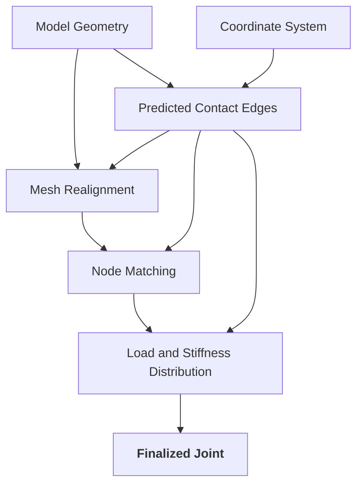

# Connections

- [Available Connections](#connection-types)
    - [Custom Joints](#custom-joint)
        - [COMBIN39 Springs](#combin39-springs)
        - [Multi-Point Constraints](#mpc184)
    - [Recommended Standard Connections](#recommended-standard-connections)
- [Assigning Connections to Nodes](#assigning-connections-to-nodes)
    - [Automatic Assignment](#automatic-assignment)
    - [Manual Assignment](#manual-assignment)

## Connection Types

### Custom Joints
Custom joints are generated from a mix of user-defined parameters and automatically extracted geometric features. The following diagram describes the workflow:

For a more detailed description of the methods, see [`methods/aligned_nodes`](../data_classes/dataclass.md/#aligned_nodes)

#### COMBIN39 Springs
A model implementation of the unreinforced masonry wall - reinforced concrete slab connection is provided with the extension. The joint involves customized [COMBIN39](https://ansyshelp.ansys.com/public/account/secured?returnurl=//Views/Secured/corp/v251/en/ans_thry/thy_el39.html) nonlinear spring elements which can transfer loads according to the rules:

**Axial**

Joints can only transfer compressive forces; governing stiffness can be selected from the following default options, or be defined by the user:

- Material with lower elastic modulus: 

$$min(E_{URM},E_{concrete})$$

- Mixed effective stiffness: 

$$\frac{1}{E_{effective}}=\frac{1}{E_{URM}}+\frac{1}{E_{concrete}}$$


Spring stiffness is approximated for each joint using the following formula:

$$k_{joint}[N/m]=E_{joint}\cdot A_{joint}$$

**Shear**

Shear transfer capability depends on the axial forces at the joint. Maximum capacity is defined by a simplification, where the joint material is omitted from analysis; leaving only:

$$k=\frac{1}{\frac{h_{URM}}{2\cdot\kappa_{URM}\cdot G_{URM}\cdot A}+\frac{h_{RC}}{2\cdot\kappa_{RC}\cdot G_{RC}\cdot A}}$$

with 

$\kappa_{URM}$:

Shear stiffness is only enabled in-plane.

**Bending Moment**

The spring elements have stiffness along the $X, Y, Z$ axes, with no rotational component $k_\theta$. Therefore, moment transfer is not explicitly modeled, but dependent on the vertical components along a joint. All joints containing more than one set of nodes can transfer moment at discrete points.

$$M = \sum_{i=1}^{N}k_i\delta_i d_i$$

**APDL Reference**

```fortran
FINISH                              ! insert snippet before solver
/PREP7                              ! preprocessing

ET,511,COMBIN39                     ! element type: x component
KEYOPT,511,3,1                      ! element DOF (1D): UX
KEYOPT,511,4,0                      ! element DOf (2D): None
R,512,-1e-3,-4e10,0,0,1e-3,0        ! load-displacement curve

ET,512,COMBIN39                     ! element type: y component
KEYOPT,512,3,2
KEYOPT,512,4,0
R,511,-1e-3,-2.5e9,0,0,1e-3,2.5e9   

ET,513,COMBIN39                     ! element type: z component
KEYOPT,513,3,3
KEYOPT,513,4,0
R,513,-1e-3,-2.5e9,0,0,1e-3,2.5e9

MAT,1                               ! material definition

CMSEL,S,S1                          ! named selection: node 1/2
*GET,NODEA,NODE,0,NUM,MIN
CMSEL,S,S2                          ! named selection: node 2/2
*GET,NODEB,NODE,0,NUM,MIN
ALLSEL,ALL

TYPE,511                            ! assign to nodes for each DOF
REAL,511
MAT,1
E,NODEA,NODEB

TYPE,512
REAL,512
MAT,1
E,NODEA,NODEB

TYPE,513
REAL,513
MAT,1
E,NODEA,NODEB

ALLSEL,ALL

FINISH                              ! end snippet
/SOLU                               ! send to solver
```

#### Multi-Point Constraints
Multi-point constraints apply kinematic constraints between selected nodes, implemented as [MPC184](https://ansyshelp.ansys.com/public/account/secured?returnurl=//Views/Secured/corp/v251/en/ans_elem/Hlp_E_MPC184.html) *constraint* or *joint* elements. The extension offers an implementation with the [*general joint*](https://ansyshelp.ansys.com/public/account/secured?returnurl=///Views/Secured/corp/v251/en/ans_elem/Hlp_E_MPC184gen.html) formulation. The elements transfer loads according to the rules:

**Axial**

**Shear**

**Bending Moment**

**APDL Reference**
```fortran
FINISH
/PREP7

ET,JTYPE,MPC184
KEYOPT,JTYPE,1,16           ! General joint
KEYOPT,JTYPE,4,1            ! Translational DOFs only: UX, UY, UZ

SECTYPE,511,JOINT,GENERAL
SECJOINT,LSYS,0,0

TB,JOIN,JMAT,,3,JNS1        ! JNS1: linear spring on UX (axial)
TBPT,,-1e-3,4e10            ! tabular load-displacement input: compression
TBPT,,0,0                   ! tabular load-displacement input: zero load
TBPT,,1e-3,0                ! tabular load-displacement input: tension
TB,JOIN,JMAT,,3,JNS2        ! JNS2: linear spring on UY (shear)
TBPT,,-1e-3,-2.5e9
TBPT,,0,0
TBPT,,1e-3,2.5e9
TB,JOIN,JMAT,,3,JNS3        ! JNS3: linear spring on UZ (shear)
TBPT,,-1e-3,-2.5e9
TBPT,,0,0
TBPT,,1e-3,2.5e9

TYPE,JTYPE
MAT,JMAT
SECNUM,JSEC

! Spring 1/5
CMSEL,S,S1
*GET,NODEA,NODE,0,NUM,MIN
CMSEL,S,S6
*GET,NODEB,NODE,0,NUM,MIN
ALLSEL,ALL

E,NODEA,NODEB

ALLSEL,ALL

FINISH
/SOLU
```

### Recommended Standard Connections
If not using the customized joints, the following connection types available in *Mechanical* provide realistic behavior for hybrid URM-RC structures:

- Frictional contact
- Rough contact

<u>Note:</u> *Fixed joints and shared nodes ****should be avoided**** since these transfer all forces.*

## Assigning Connections to Nodes

Connection properties and types are defined in the **Connections** panel.


### Automatic Assignment
Using the *Find groups* button on the **Connections** 

### Manual Assignment
Contact nodes can be manually defined by the user in case of customized local connections.