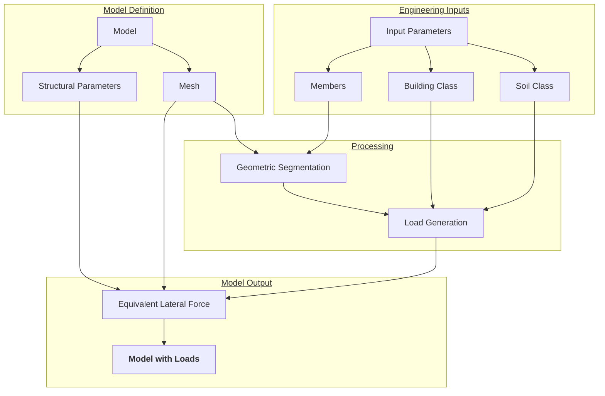

# Overview

## Load Generation Workflow

### Visual overview

```mermaid
flowchart TB

    subgraph "<u>Engineering Inputs</u>"
        E[Input Parameters]
        Ea[Building Class]
        Eb[Soil Class]
        Ec[Members]

        click Ea "#building-class"
        click Ea "#soil-class"
        click Ec "#geometry-materials-and-connections"
        E --> Ea
        E --> Eb
        E --> Ec
    end

    subgraph "<u>Model Definition</u>"
        A[Model]
        D[Structural Parameters]
        B[Mesh]

        click A "inputs.md/#geometry-materials-and-connections"
        click D "#geometry-materials-and-connections"
        A --> D
        A --> B
    end

    subgraph "<u>Processing</u>"
        F[Geometric Segmentation]
        G[Load Generation]

        B --> F
        Ec --> F
        F --> G
        Ea --> G
        Eb --> G
    end
    
    subgraph "<u>Model Output</u>"
        H[Equivalent Lateral Force]
        I[<b>Model with Loads</b>]

        D --> H
        B --> H
        G --> H
        H --> I
    end
```
### Walkthrough