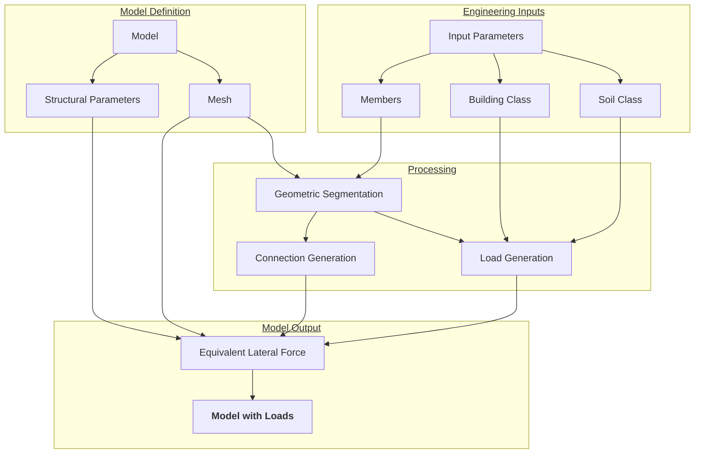

# Overview

This page describes the load generation and equivalent lateral force-based seismic analysis workflow, following the procedure outlined in the SIA 260 code.

## Visual overview

## Walkthrough

### 1. Model Definition
#### 1.1. Geometric Model
Geometric model can be directly imported from *ANSYS Discovery* or *SpaceClaim* if using *Workbench*. Verification workflows were tested with shell elements, however solid elements should be compatible with most analyses and features.

<u>**Note:**</u> *Most of the functions are designed to work with regular geometries and perfectly aligned connections. These may exhibit unexpected behavior if the given geometry does not conform.*

#### 1.2. Structural Parameters
**Materials**

Materials are defined in *Mechanical* or *Workbench*. Nonlinear behavior is accepted.

**Connections**

Element connectivities should be defined according to project specifications. The default workflow:

1. Finds potential masonry wall-RC slab joints
2. Assigns selected connections between the identified connection groups if desired. For available connection types, see [Connections](../connections.md).

**Elements**

By 

#### 1.3. Meshing

### 2. Engineering Inputs

#### 2.1. Members
#### 2.2. Building Class
#### 2.3. Site Data

### 3. Processing
#### 3.1. Geometric Segmentation
#### 3.2. Load Generation
**Assigned Loads**

**Period Estimation**

Period estimation involves three options based on the new and old versions of the SIA 260 code:

- Estimate from displacement: $T_1=2\cdot\sqrt{u}$
- Estimate from height (2003): $T_1=h^{0.75}$
- Modal analysis

For detailed process, see [Period Estimation](period.md).

**Seismic Loads**

### 4. Model Output
#### 4.1. Equivalent Lateral Force
#### 4.2. Deformations