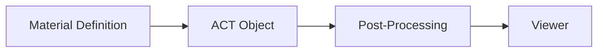

# Structural Verification for Masonry and Concrete

- [Overview](#overview)
- [Masonry](#masonry)
    - [Material Properties](#material-properties)
    - [Failure Criteria](#failure-criteria)
- [Reinforced Concrete](#reinforced-concrete)
    - [Material Properties](#material-properties-1)
    - [Failure Criteria](#failure-criteria-1)
- [Visualization](#visualization)

## Overview
Various materials are processed in parallel to the *Mechanical* simulation, where results are post-processed to discover governing effects on membranes. Material properties and failure criteria are defined before simulation, and results can be viewed in a standalone viewer or laid over to the geometry preview.

## Masonry

### Material Properties
Folllowing material properties can be defined as a tabular input directly in the simulation panel:

*(required properties in ***bold***)*

| *Property* | *Input Type* | *Default* |
| --- | --- | --- |
| **Body** | **ANSYS Geometry** | - |
| **Material** | **Engineering Material** | - |
| $f_{my}$ | Yield Stress [model units] | $8 MPa$ |
| $\phi_{gs}$ | Sliding Failure Angle [°] | $31°$ |
| Number of Layers | integer | 4 |
| **Body Thickness** | **model units** | $1 mm$ |
| Layer Angle | degrees | $0°$ |
| Local Material Direction | axis | automatic |
| **Apply** | **Application Trigger** | - |

### Failure Criteria
Two types of failure are considered: **crushing** and **sliding**.

<u>Crushing</u>

$$\sigma_3\geq f_{my}$$

<u>Sliding</u>

$$\tan{\phi_{gs}}\geq31°$$

## Reinforced Concrete

### Material Properties
Folllowing material properties can be defined as a tabular input directly in the simulation panel:

*(required properties in ***bold***)*

| *Property* | *Input Type* | *Default* |
| --- | --- | --- |
| **Body** | **ANSYS Geometry** | - |
| **Concrete Material** | **Engineering Material** | - |
| Number of Layers | integer | 4 |
| **Body Thickness** | **model units** | $1 mm$ |
| Layer Angle | degrees | $0°$ |
| Local Material Direction | axis | automatic |
| Model Reinforcement as Layer | Yes / No | No |
| Reinforcement Material | Engineering Material | - |
| $A_s/A_g$ | Reinforcement Ratio [%] | $0%$ |
| Rebar Side | local axis | +z |
| Concrete Cover | model units | $5 mm$ |
| Custom Concrete Model | Add custom cross-section | - |
| **Apply** | **Application Trigger** | - |

### Failure Criteria

## Visualization

### Viewer Panel

### Overlay